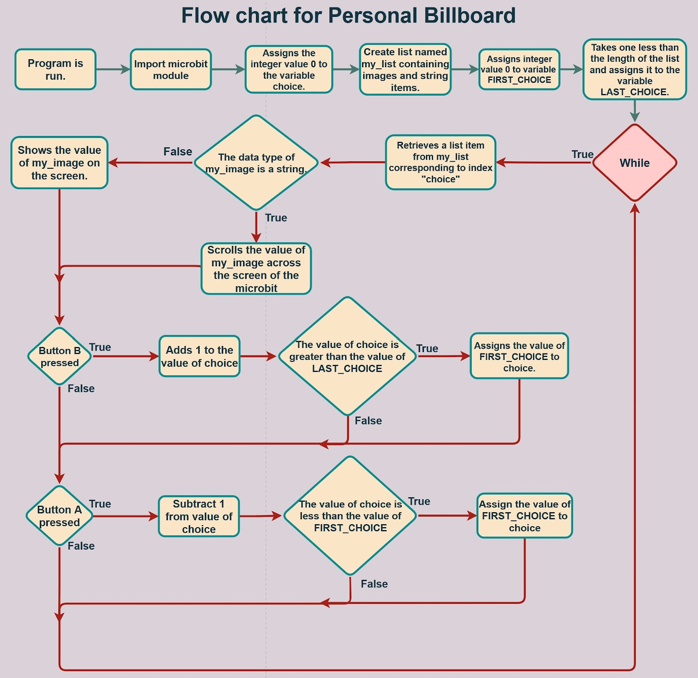

# Microbit_Personal_Billboard
Lesson 5 from my Intro to Python course with Microbit

Overview: This program allows the user to scroll through images and text and display them on the microbit screen. The user can use buttons A and B to scroll backward and forward through the list of items. When it gets to the end of the list, it starts again at the beginning and vice versa. There is also a conditional statement to scroll any string items in the list and show any image items in the list. This is because when display.show() is used with a string if the string is longer than a certain length, it is cut off. Therefore, with strings, using display.scroll() will scroll the string across the screen which allows the user to read the string completely without missing anything.

Learnings: In this lesson, I learned a new function, type(), which allows you to check the data type of the passed in argument. This function is important because some python functions only take certain data types as an argument and so, this function can be applied to allow the program to effectively handle these data types without encountering any errors. I also learned about lists which are data structures within python. These lists can contain a mix of data types and provide easy access to each item in the list through the use of an index that corresponds to the desired item. This makes for an effective way to store and access data in python and also new data can be easily added to the list by simply putting a comma and inputting the data. These lists can be utilized and applied in programs to organize and handle large amounts of data with relative ease.

Connections: Some real-world connections I made with lists, in the context of this program, are menus of any kind, such as at restaurants or on a website. These menus are connected to lists in this program because in the program the items in the list are shown on the screen and the user can use the buttons to scroll through the items, they can pick which item to display. Similarly, in menus, the user can browse through each item and pick one. For example, if I was at a restaurant I would look at the menu and order any food I want or on a website, I can look through the menu options and click on any of them based on what I want.

